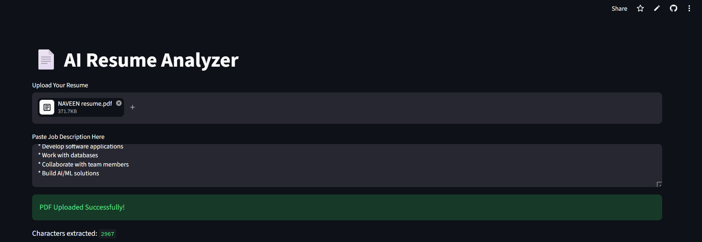

# AI Resume Analyzer

AI Resume Analyzer is a web application built using Python and Streamlit that analyzes PDF resumes, extracts text, detects technical skills, and compares resumes with job descriptions.

## Features

* Upload PDF resumes
* Extract text from resumes
* Detect technical skills
* Compare resumes with job descriptions
* ATS-style resume analysis
* Interactive Streamlit interface

## Screenshots

### Home Page

### Resume Upload

### Analysis Results

* 

## Technologies Used

* Python
* Streamlit
* PyPDF

## Project Structure

AI-Resume-Analyzer/

├── app.py

├── skills.py

├── requirements.txt

## Installation

pip install -r requirements.txt

streamlit run app.py

## Live Demo

https://ai-resume-analyzer-byvpbp2pyhdqlryz6kzoml.streamlit.app/

